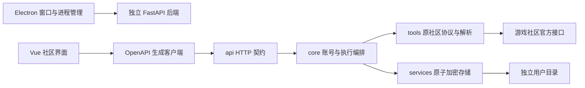

# 独立版结构与边界

来源：`AUTO-MAS-Project/AUTO-MAS` 的 `78bc197e5c37ca4ece98f5b4f07f90fe631b814a`。只迁入社区功能需要的模块；原仓库不因本次拆分修改。

| 目录 | 责任与约束 |
| --- | --- |
| `app/tools` | 沿用上游平台协议、签名、凭据补全、角色发现、签到结果及日常解析；不依赖 MAS Config |
| `app/core` | 账号编辑、凭据回写、签到与便笺执行锁、定时触发和持久化状态协调 |
| `app/models` | 独立持久化结构与 API 契约；不执行文件或网络操作 |
| `app/services` | Windows DPAPI、Linux AES-GCM 与 Workers 加密存储；原子替换、独立网络参数与有限 MAS 连接 |
| `app/api` | 输入输出转换和固定的登录错误信息，不承载上游工作流 |
| `frontend/src` | 账号、签到、便笺、抽卡、MAS 和设置页面；持久状态以后端为准 |
| `frontend/electron` | 单实例、窗口、独立后端启动、健康检查和退出管理；不暴露 Node 到渲染页 |

`CommunityAccount` 是兼容原社区编排字段读写的小包装，不迁入完整 ConfigBase 或专项任务管理器。签到与便笺使用各自执行锁；用户修改账号和设置时检查是否有执行中的请求。配置写盘完成后才更新内存；请求取消时等待已开始的写盘完成，保持文件与内存一致。

桌面后端直接绑定 `127.0.0.1` 的随机空闲端口，在启动成功后告知 Electron。关闭或终止 Electron 会关闭输入管道，后端收到 EOF 后退出；正常关闭留出请求清理时间，超时仅终止自身子进程。开发热更新使用独立的 37164/37165，不占原 MAS 端口。

API 使用 `X-Community-Session` 请求；桌面模式通过同源握手建立进程内会话，只监听环回地址。完整后端允许显式启用 `--remote` 后对外监听，必须配置 HTTPS 公开来源与访问密码；会话最长12小时，失败登录受限。Electron 使用原生标题栏、sandbox、contextIsolation，关闭 nodeIntegration。登录密码、扫码临时票据不写入状态文件，错误与日志不回显原始登录请求。

`app/core/kuro_login.py` 管理10分钟短信会话、手机号冷却与验证码尝试上限；免费/云码验证有总时限，取消会话会取消正在运行的验证协程。第三方验证码 SDK 仅在 `/captcha.html` 中加载，该路径独立配置官方资源策略，主应用保留原策略；消息校验来源窗口、随机 nonce 与类型。验证码票据仅用于当次请求。

`app/core/gacha.py` 编排读取、去重与统计；`app/tools/gacha.py` 仅处理六游戏协议与导入转换，按官方主机白名单重建请求，临时授权链接不入库。抽卡数据独立于签到结果，保留字符串ID与角色、卡池边界。

纯 Workers 的 `deploy/worker/src/entry.py` 将 API 交给固定名称的单用户 Durable Object，复用相同 ASGI 应用。`FetchTransport` 将 HTTPX 请求交给 Workers Fetch；`DurableStorage` 将整份状态压缩加密，在 SQLite 事务中分块替换。状态上限8MB；多个使用者应部署独立实例。Cron每5分钟检查北京时间计划，运行前持久化当日尝试标记；不提供桌面“启动时签到”的语义。详见 [部署说明](DEPLOYMENT.md)。

桌面外壳没有 MAS 运行环境下载器、专项脚本、插件市场、管理员提权、Sentry、组织发布和自动更新配置。通知模块经用户确认不在独立版首期范围。原协议中的云游戏通知确认、结果附加标记仍保留，因为它们参与奖励领取和结果转换。

本轮来源文件及 SHA-256 见 `upstream-files.json`。平台代码采用小范围依赖替换；前端保留便笺、扫码状态机和有效注释，应用外壳、账号与设置页重新组织为社区专用入口。原始图标文件保留，实际渲染使用派生 WebP。

后续新增功能应先明确支持的社区、账号权限及用户可观察的行为，再按 models → core/tools → api → 生成客户端 → 页面流程补齐；不要把 MAS 的完整公共模块重新复制进来。
